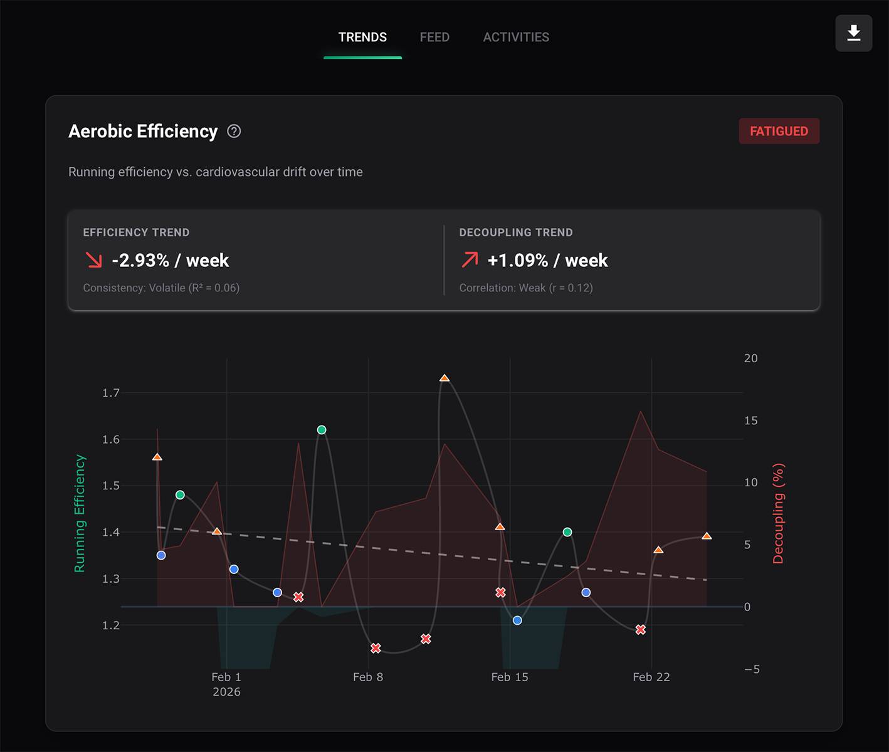
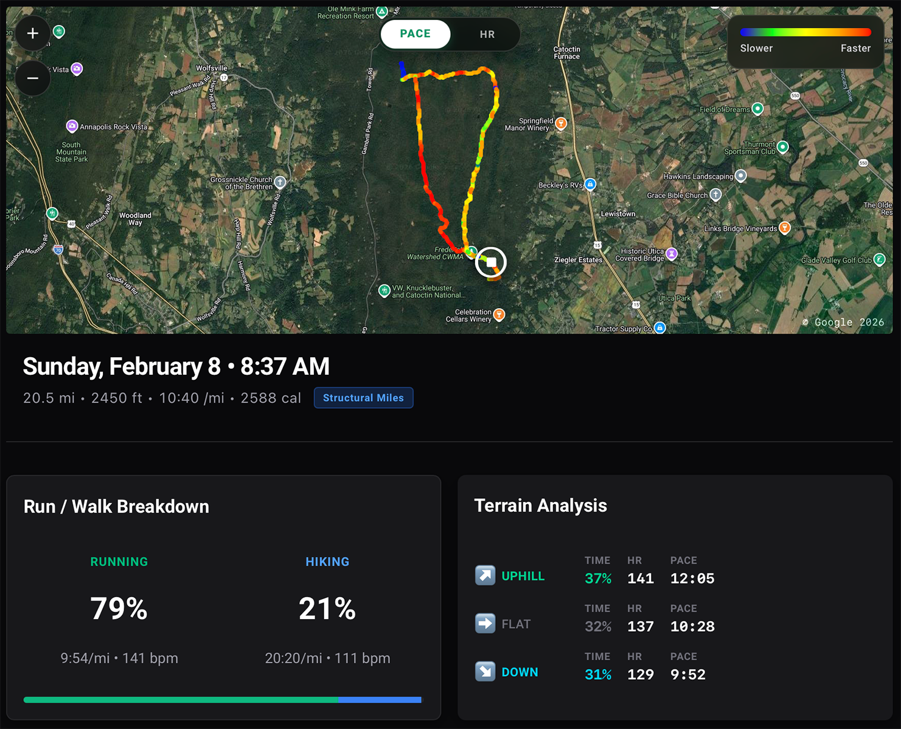
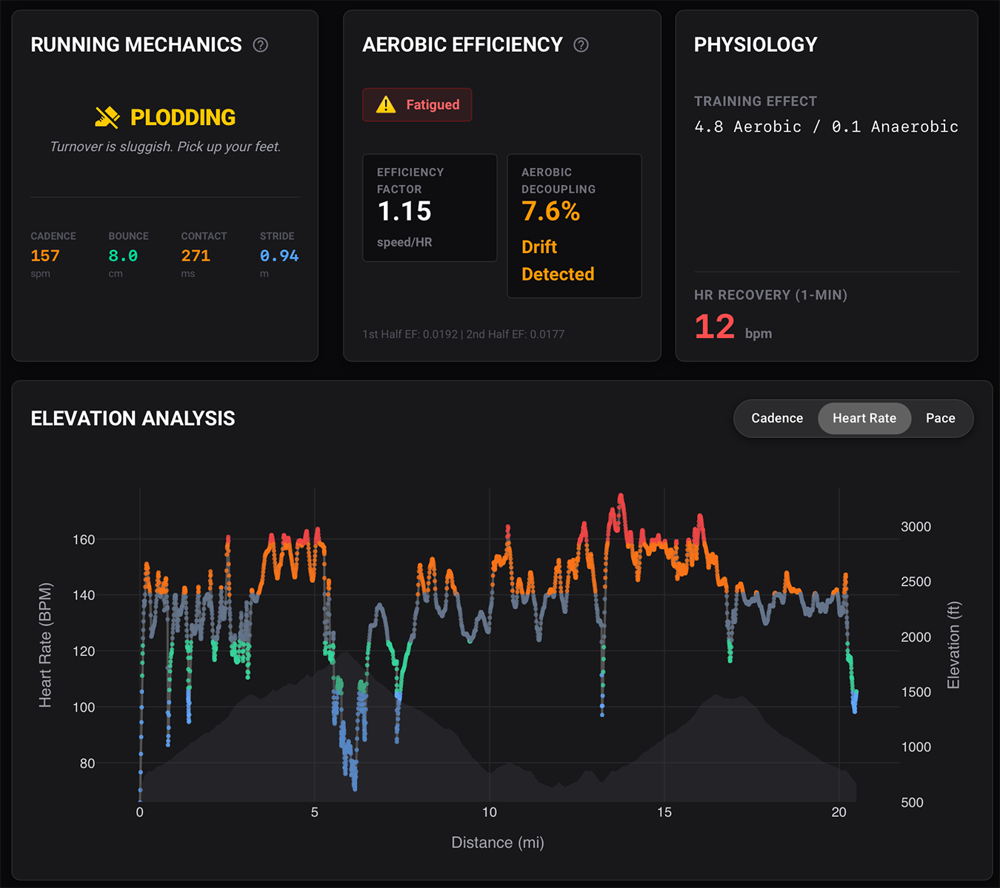
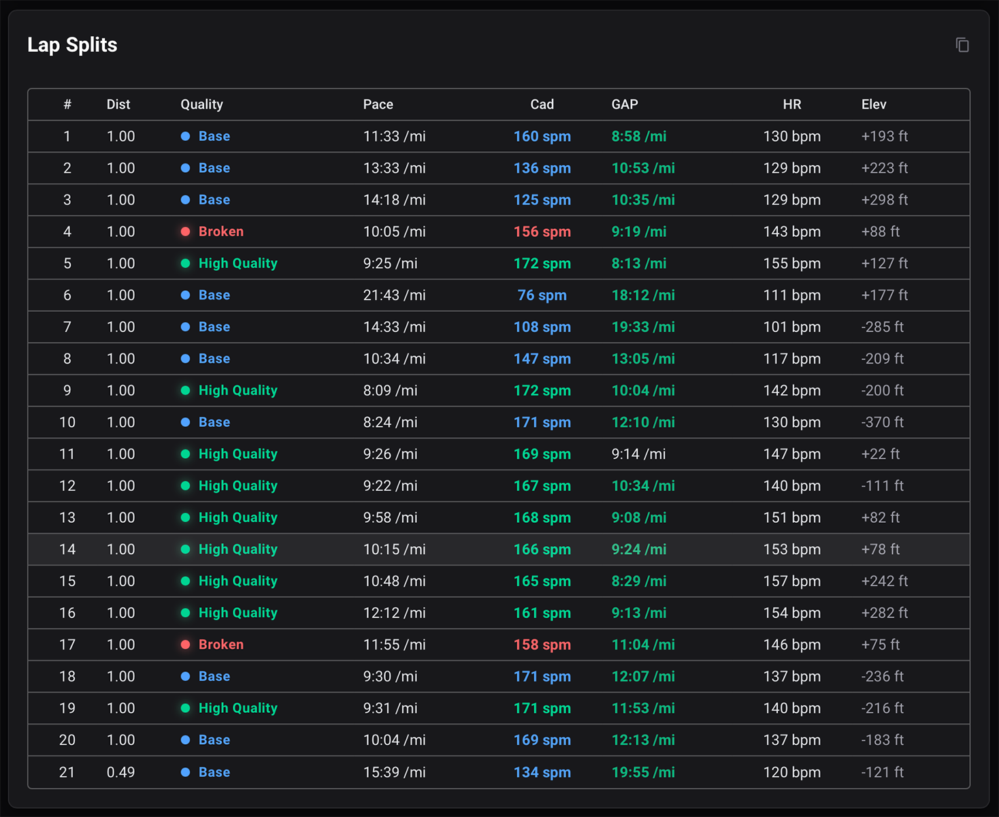

# Ultra State 🏃‍♂️💨

Ultra State is a web-based desktop application for runners who want to unlock the advanced training metrics that Garmin Connect hides without drowning in an endless sea of metrics and graphs that have no tangible takeaways like most paid apps. This platform analyzes your .FIT files into actionable insights about aerobic efficiency, cardiac drift, and running form—all optimized for immediate export and analysis by your LLM of choice (ChatGPT, Claude, Gemini, whatever).

Ultra State is optimized to give you only data that has actionable takeaways for efficiency and durability. 

No garbage data here - if you feed this into your homerolled AI running coach, Ultra State will help you adjust your form (cadence), avoid or heal from injuries, and maximize a weekly training plan based on your own body's ever-changing capabilities. Like our training, this tool is a work in progress so contributions, suggestions, and positive vibes will help us all.


## ✨ Features

- 📁➕ **Smart Import** - Point Ultra State to a local folder with `.fit` files (Settings → Change Folder). It continuously watches that folder and skips duplicates already in the library.
- 🎯 **Performance Verdicts** - Every run is analyzed and categorized:
  - **High Quality Miles** - Fast, efficient, and stable cardiac response.
  - **Structural Miles** - Steady aerobic effort, building durability.
  - **Broken Miles** - Struggling pace or high cardiovascular drift.
- 🏃 **Advanced Metrics**:
  - **Training Load:** Gamified workout stress score with visual ring indicator
  - **Efficiency Factor (EF):** Your "gas mileage" (Speed ÷ Heart Rate)
  - **Aerobic Decoupling (Cost):** Measures cardiac drift and durability
  - **Heart Rate Recovery (HRR):** 1-minute post-run HR drop
  - **Running Form Analysis:** Cadence trends with form status (Elite, Good, Overstriding, etc.)
  - **Activity Breakdown:** Run/Walk strategy row and terrain stats
  - Elevation gain tracking with grade-adjusted pace (GAP)
- � **Interactive Training Trends** - Three dedicated views (Quality, Volume, and Form) to analyze your fitness over any date range.
- 🗺️ **Activity Information Modal** - Deep dive into any run with a keyboard-navigable interface:
  - Interactive Leaflet map with Pace and HR Zones heatmaps
  - Color-coded Lap Splits table with GAP
  - Body Response section detailing EF, Cadence, and Cardiac Cost
- 📋 **LLM-Ready Export** - One-click copy optimized for any LLM interface with comprehensive coaching context:
  - Physiology metrics (HR zones, Training Effect, Power)
  - Mechanics analysis (Cadence, Form status, Activity breakdown)
  - Lap-by-lap splits with cadence tracking
  - Weather context and terrain analysis
- 💾 **CSV & Chart Export** - Export filtered data for Excel/Sheets or combined PNG images of your trends
- 🔄 **Cross-Platform** - Works on both Windows and macOS
- 📦 **Standalone Executables** - Non-developers can just download the [latest release](https://github.com/themeaningofmeaning/ultra-state/releases)

## 📸 Screenshots

### 1. Macro Trends & Performance Verdicts

*Gain a 30,000-foot view of your training blocks. Track Efficiency vs Decoupling over time, examine your Volume Load (Recovery through Overreaching), and see every run instantly categorized with dynamic Verdict Pills based on form and cardiac response.*

### 2. Route & Strategy Breakdown 

*Stop guessing where you struggled. The interactive Leaflet Pace Heatmap works in tandem with the Run/Walk Strategy analysis to show exactly how you attacked the trail, identifying every hike and surge along the route.*

### 3. Body Response & Mechanics

*Compare your Heart Rate directly against the Elevation profile to understand cardiovascular stress, backed by premium insights into your Efficiency Factor (EF), Average Cadence, Form Verdict, and overall Cardiac Cost (Decoupling).*

### 4. Deep Data Splits & GAP

*Granular lap-by-lap mechanics including color-coded Grade-Adjusted Pace (GAP) and Cadence tracking, perfectly optimized for LLM analysis.*

## 📈 Analyzing Your Trends

The application features three main interactive trend graphs, which recalculate dynamically as you zoom or pan to different date ranges:

1. **Quality (Efficiency & Decoupling):** Tracks your Efficiency Factor (speed vs. heart rate) and Aerobic Decoupling (cardiac drift) over time. This shows if your aerobic engine is improving.
2. **Training Volume:** Keep tabs on your overall workload through three distinct lenses:
   - **Training Load:** Breakdown by effort (Recovery, Base, Productive, Overreaching).
   - **HR Zones:** See the exact time-in-zone distribution.
   - **Training Mix:** The balance between your High Quality, Structural, and Broken miles.
3. **Form:** Monitors your average cadence and provides form verdicts, helping you pinpoint technique breakdown over a training block.

## 🔍 What the Metrics Mean

| Metric | Description | Good Range | Why It Matters |
|--------|-------------|------------|----------------|
| **Training Load** | Recovery: <75<br>Base: 75-150<br>Productive: 150-300<br>Overreaching: 300+ | Measures total workout stress - helps balance hard training with recovery |
| **Efficiency Factor (EF)** | Speed ÷ Heart Rate | Higher = Better | Your "gas mileage" - tracks aerobic engine development |
| **Aerobic Decoupling (Cost)** | HR drift over time | < 5% = Excellent | Measures cardiovascular durability and fatigue resistance |
| **HR Recovery (HRR)** | HR drop in 60 seconds | > 30 bpm = Excellent | Indicates aerobic fitness and recovery capacity |
| **Cadence** | Steps per minute | 170-180 spm optimal | Higher cadence = better form efficiency |

### 💡 Understanding Aerobic Decoupling

Decoupling measures how much your heart rate rises to maintain the same pace over time (cardiac drift). It's calculated by comparing the first half vs. second half of your run:

- **< 5%:** Excellent durability. Your aerobic system stayed efficient throughout.
- **5-10%:** Moderate drift. Acceptable for tempo/threshold work.
- **> 10%:** High fatigue. Either you ran too fast for your current fitness, or you're carrying accumulated fatigue from recent training.

### 🫀 Why HR Recovery Matters

HR Recovery (HRR) measures how fast your heart rate drops 60 seconds after you stop running. It's one of the best indicators of aerobic fitness and autonomic nervous system health.

**Common Causes of Low HRR (<20 bpm):**
1. **The Cooldown Effect** (Most Common): If you jog or walk before pressing stop, your HR is already low, so the drop will be small. For a true test, stop immediately after your hardest effort.
2. **Dehydration & Heat**: Thicker blood keeps HR elevated.
3. **Accumulated Fatigue**: Your body is struggling to recover from recent hard training.

## 💬 LLM Integration

The app generates reports specifically optimized for LLM analysis. Each run includes:

- **Performance Metrics**: Distance, pace, elevation
- **Efficiency Data**: EF, aerobic decoupling, HR recovery
- **Form Analysis**: Cadence trends
- **Context**: Color-coded performance category

### 📋 Recommended Prompt Strategy
> "I am providing three pieces of data:
> 1. My **Activities Overview** (past 3 months of training).
> 2. My **Splits** for today's run.
> 3. The **Analyzer Report** for today's run (efficiency & decoupling).
>
> **Task:** Analyze today's performance in the context of my recent training load. Was the high cardiac drift caused by poor pacing (see Splits csv, attached), or accumulated fatigue from the last 2 weeks (see Activities csv, attached)?"

## 📂 Project Structure

```
ultra-state/
├── app.py                  # Lifecycle router + app orchestration
├── analyzer.py             # Analysis primitives + FIT parsing helpers
├── constants.py            # Global enums, colors, and configuration
├── db.py                   # SQLite database manager for activity metadata
├── hr_zones.py             # Heart rate zone calculation utilities
├── library_manager.py      # Local directory watching and FIT file ingestion
├── state.py                # Reactive application state object
├── updater.py              # Auto-updater checker for GitHub releases
├── core/
│   ├── data_manager.py     # DataFrame ownership, filtering, classification, CSV export
│   ├── llm_export.py       # Copy-for-AI export orchestration
│   └── map_payload.py      # Map payload generation/backfill + geometry/color migration
├── components/
│   ├── activity_modal.py   # Activity detail modal
│   ├── analysis_view.py    # Trends dashboard
│   ├── cards.py            # Reusable NiceGUI card render helpers
│   ├── charts.py           # Reusable Plotly chart builders
│   ├── layout.py           # App shell (sidebar/header/FAB)
│   ├── library_modal.py    # Library settings + sync UI
│   └── run_card.py         # Feed run card renderer
├── assets/                 # Screenshots and images
├── build_mac.sh            # macOS build script
├── build_windows.bat       # Windows build script
├── runner.icns             # macOS app icon
├── runner.ico              # Windows app icon
├── requirements.txt        # Python dependencies
├── BUILD_INSTRUCTIONS.md   # Detailed build guide
├── ARCHITECTURE.md         # Architectural boundaries and rules
├── tests/                  # Analyzer/library tests
└── README.md
```

## 🚀 Installation

### Option 1: Download the App (Easiest)

Don't want to mess with Python code? No problem.

1. **[Click here to go to the Releases page](https://github.com/themeaningofmeaning/ultra-state/releases).**
2. 🍎**Mac Users:** Download `UltraState.dmg` or `UltraState-macOS.zip`.
3. 🪟**Windows Users:** Download `UltraState-Windows.zip`, unzip it, and run the executable.

### Option 2: Run from Source (For Developers)

If you want to modify the code or contribute:

```bash
# Clone the repository
git clone https://github.com/themeaningofmeaning/ultra-state.git
cd ultra-state

# Create virtual environment (recommended)
python -m venv venv
source venv/bin/activate  # On macOS/Linux
# or: venv\Scripts\activate  # On Windows

# Install dependencies
pip install -r requirements.txt

# Run the application
python app.py
```

By default, Ultra State launches as a native desktop window (NiceGUI native mode) when you run `python app.py`.

## ⚙️ .FIT Library Configuration

- **Library Folder Watch:** Open **Settings** from the sidebar, click **Change Folder**, and select your local `.fit` library directory.
- Ultra State will monitor that folder, import new runs, and avoid duplicate ingestion.

## 🔨 Building Executables

Want to create standalone executables? We've got you covered.

### For macOS
```bash
./build_mac.sh
# Output: dist/UltraState.app
```

### For Windows
```cmd
build_windows.bat
# Output: dist\UltraState.exe
```

See [BUILD_INSTRUCTIONS.md](BUILD_INSTRUCTIONS.md) for detailed build documentation and troubleshooting.

## 🛠️ Built With

* **[NiceGUI](https://nicegui.io/)** - Python web UI framework with native desktop support
* **[Plotly](https://plotly.com/)** - Interactive, publication-quality graphs
* **[Kaleido](https://github.com/plotly/Kaleido)** - Static image export for Plotly charts
* **[FitParse](https://github.com/dtcooper/python-fitparse)** - Low-level FIT file parsing
* **[Pandas](https://pandas.pydata.org/)** & **[NumPy](https://numpy.org/)** - Data manipulation and analysis
* **[SciPy](https://scipy.org/)** - Linear regression for trend analysis
* **[Pillow](https://python-pillow.org/)** - Image processing for chart export
* **[PyInstaller](https://pyinstaller.org/)** - Standalone executable packaging

## 📜 License

This software is provided under the **PolyForm Noncommercial License 1.0.0**.

You are free to download, read, modify, and compile this software for your own **personal, non-commercial use**. 

You may not use this software, or any modified version of it, for any commercial purpose. This includes, but is not limited to:
- Selling copies of the software.
- Charging for access to the software.
- Using the software to provide a commercial service (e.g., paid coaching).

For more details, see the [LICENSE](LICENSE) file.

## 🤝 Contributing

Contributions are welcome! Here's how:

1. Fork the repository
2. Create a feature branch (`git checkout -b feature/amazing-feature`)
3. Make your changes
4. Test thoroughly (`python -m pytest tests` when available)
5. Submit a pull request

## 🙏 Acknowledgments

- Aerobic decoupling methodology inspired by endurance training science
- Performance categorization based on Efficiency Factor research
- Built with love for the running community

## 📧 Contact

Questions? Suggestions? Open an issue or reach out!

---
*Built with ❤️ for 🏃‍♂️ and ⛰️ by Dylan Goldfus*
