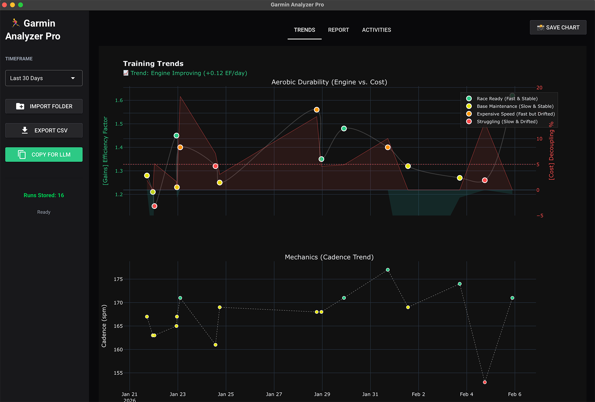
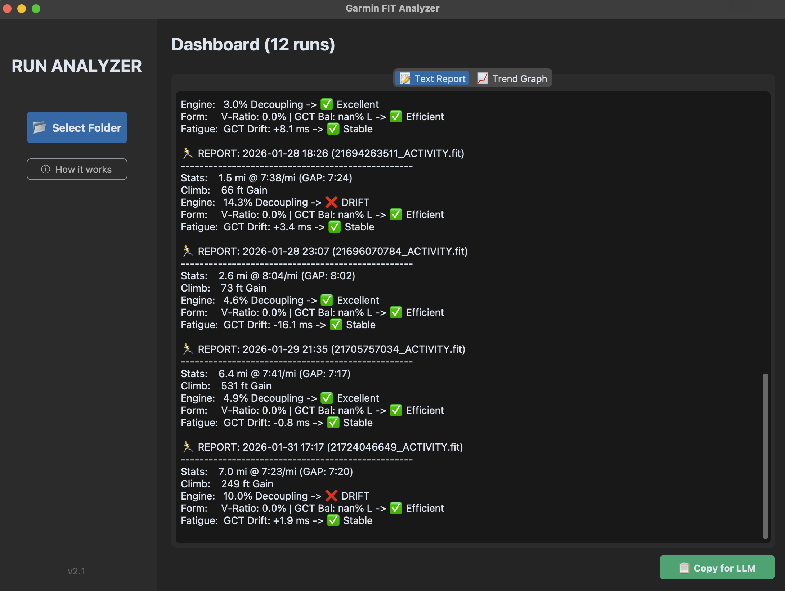

# Garmin Analyzer Pro 🏃‍♂️💨

Garmin Analyzer Pro is a modern web-based desktop application for runners who want to unlock the advanced training metrics that Garmin Connect hides. Built with a sleek dark-mode interface, it transforms your .FIT files into actionable insights about aerobic efficiency, cardiac drift, and running form—all optimized for analysis by your LLM of choice (ChatGPT, Claude, Gemini, whatever).

This project is built for serious runners who want deeper insights into efficiency and durability. It's not garbage data - if you feed this into your homerolled LLM running coach, it will help you adjust your form (cadence), avoid or heal from injuries, and maximize a weekly training plan based on your own body's ever-changing capabilities (ex. x12 hill sprints on Tue, rest Wed to lock in gains, 10 mile pace run Fri, etc.). Like our training, this tool is a work in progress so contributions, suggestions, and positive vibes will help us all.


## ✨ Features

- 🌐 **Modern Web UI** - Sleek dark-mode interface
- � **Smart Import** - Drag-and-drop folder selection with automatic deduplication
- 📊 **Interactive Charts** - Zoom, pan, and explore your training trends with Plotly
- 🎯 **Performance Categorization** - Every run color-coded by quality:
  - 🟢 **Race Ready** (Fast & Stable)
  - 🟡 **Base Maintenance** (Slow & Stable)
  - 🟠 **Expensive Speed** (Fast but Drifted)
  - 🔴 **Struggling** (Slow & Drifted)
- 🏃 **Advanced Metrics**:
  - **Efficiency Factor (EF):** Your "gas mileage" (Speed ÷ Heart Rate)
  - **Aerobic Decoupling (Cost):** Measures cardiac drift and durability
  - **Heart Rate Recovery (HRR):** 1-minute post-run HR drop
  - Cadence trends and form analysis
  - Elevation gain tracking
- � **Live Trend Analysis** - Zoom into any date range and see fitness trends recalculate in real-time
- �️ **Activity Management** - View, filter, and delete runs with inline controls
- � **LLM-Ready Export** - One-click copy optimized for ChatGPT/Claude/Gemini
- 💾 **CSV Export** - Export filtered data for Excel/Sheets analysis
- 📸 **Chart Export** - Save trend graphs as PNG images
- 🔄 **Cross-Platform** - Works on Windows and macOS
- 📦 **Standalone Executables** - No Python installation required

## 📸 Screenshots

### Interactive Training Trends

*Zoom-responsive charts with live trend analysis and performance categorization*

### Detailed Run Reports

*Professional cards with HR Recovery, Efficiency Factor, and Aerobic Decoupling*

### 📈 How to Read the Chart

The trend chart uses a smart 4-color system to categorize the **Quality** of every run based on two key metrics: Efficiency Factor (your speed relative to heart rate) and Aerobic Decoupling (cardiac drift):

- � **Race Ready (Fast & Stable):** High EF + Low Decoupling (<5%). You were fast and your cardiovascular system stayed efficient. Peak performance.
- 🟡 **Base Maintenance (Slow & Stable):** Low EF + Low Decoupling (<5%). A controlled easy run building aerobic base without fatigue.
- � **Expensive Speed (Fast but Drifted):** High EF + High Decoupling (>5%). You ran fast, but your heart rate drifted significantly. Unsustainable effort.
- 🔴 **Struggling (Slow & Drifted):** Low EF + High Decoupling (>5%). You were slow *and* your HR drifted. Sign of accumulated fatigue or poor conditions.

**Interactive Features:**
- Click legend items to toggle traces on/off
- Drag to zoom into specific date ranges
- Double-click to reset zoom
- Hover over points for detailed run stats
- Trend subtitle updates based on visible data

## 🚀 Installation

### Option 1: Download the App (Easiest)

Don't want to mess with Python code? No problem.

1. **[Click here to go to the Releases page](https://github.com/themeaningofmeaning/garmin-fit-analyzer/releases).**
2. 🍎**Mac Users:** Download `GarminAnalyzerPro.dmg` or `GarminAnalyzerPro-macOS.zip`.
3. 🪟**Windows Users:** Download `GarminAnalyzerPro-Windows.zip`, unzip it, and run the executable.

### Option 2: Run from Source (For Developers)

If you want to modify the code or contribute:

```bash
# Clone the repository
git clone https://github.com/themeaningofmeaning/garmin-fit-analyzer.git
cd garmin-fit-analyzer

# Create virtual environment (recommended)
python -m venv venv
source venv/bin/activate  # On macOS/Linux
# or: venv\Scripts\activate  # On Windows

# Install dependencies
pip install -r requirements.txt

# Run the application
python app.py
```

The app will open in your default browser at `http://localhost:8080`.

## 🔨 Building Executables

Want to create standalone executables? We've got you covered.

### For macOS
```bash
./build_mac.sh
# Output: dist/GarminAnalyzerPro.app
```

### For Windows
```cmd
build_windows.bat
# Output: dist\GarminAnalyzerPro.exe
```

See [BUILD_INSTRUCTIONS.md](BUILD_INSTRUCTIONS.md) for detailed build documentation and troubleshooting.

## 🔍 What the Metrics Mean

| Metric | Description | Good Range | Why It Matters |
|--------|-------------|------------|----------------|
| **Efficiency Factor (EF)** | Speed ÷ Heart Rate | Higher = Better | Your "gas mileage" - tracks aerobic engine development |
| **Aerobic Decoupling (Cost)** | HR drift over time | < 5% = Excellent | Measures cardiovascular durability and fatigue resistance |
| **HR Recovery (HRR)** | HR drop in 60 seconds | > 30 bpm = Excellent | Indicates aerobic fitness and recovery capacity |
| **Cadence** | Steps per minute | 170-180 spm optimal | Higher cadence = better form efficiency |

### 💡 Understanding Aerobic Decoupling

Decoupling measures how much your heart rate rises to maintain the same pace over time (cardiac drift). It's calculated by comparing the first half vs. second half of your run:

- **< 5%:** Excellent durability. Your aerobic system stayed efficient throughout.
- **5-10%:** Moderate drift. Acceptable for tempo/threshold work.
- **> 10%:** High fatigue. Either you ran too fast for your current fitness, or you're carrying accumulated fatigue from recent training.

### 🫀 Why HR Recovery Matters

HR Recovery (HRR) measures how fast your heart rate drops 60 seconds after you stop running. It's one of the best indicators of aerobic fitness and autonomic nervous system health.

**Common Causes of Low HRR (<20 bpm):**
1. **The Cooldown Effect** (Most Common): If you jog or walk before pressing stop, your HR is already low, so the drop will be small. For a true test, stop immediately after your hardest effort.
2. **Dehydration & Heat**: Thicker blood keeps HR elevated.
3. **Accumulated Fatigue**: Your body is struggling to recover from recent hard training.

## 💬 LLM Integration

The app generates reports specifically optimized for LLM analysis. Each run includes:

- **Performance Metrics**: Distance, pace, elevation
- **Efficiency Data**: EF, aerobic decoupling, HR recovery
- **Form Analysis**: Cadence trends
- **Context**: Color-coded performance category

### 🔒 LLM Safety Lock

The app automatically disables the "Copy for LLM" button when you select large timeframes (All Time, This Year) to prevent overwhelming your LLM with too much data. Stick to Last 30/90 Days or Last Import for best results.

### 🧠 Pro Tip: Getting the most out of your Garmin data w/ this app

For the most powerful insights, combine these three data sources. This allows the AI to distinguish between a "bad day" and a "bad month."

**1. The Macro Trends (Scope: All History)**
* **File:** `Activities.csv`
* **Source:** Garmin Connect Web $\rightarrow$ *Activities List* $\rightarrow$ Export CSV.
* **Why:** Provides your 90-day baseline. It tells the LLM if your fitness is trending up or down over time.

**2. This App's Report (Scope: This Run Only)**
* **File:** Clipboard Text
* **Source:** **Garmin Analyzer App** $\rightarrow$ "Copy for LLM".
* **Why:** Provides the deep-dive mechanics (Decoupling, Form Efficiency) that Garmin Connect hides.

**3. The Splits (Scope: This Run Only)**
* **File:** `activity_1234.csv`
* **Source:** Garmin Connect Web $\rightarrow$ *Specific Activity* $\rightarrow$ Export Splits to CSV.
* **Why:** Shows pacing strategy. It tells the LLM exactly *where* in the run you started to struggle.

### 📋 Recommended Prompt Strategy
> "I am providing three pieces of data:
> 1. My **Activities Overview** (past 3 months of training).
> 2. My **Splits** for today's run.
> 3. The **Analyzer Report** for today's run (efficiency & decoupling).
>
> **Task:** Analyze today's performance in the context of my recent training load. Was the high cardiac drift caused by poor pacing (see Splits csv, attached), or accumulated fatigue from the last 2 weeks (see Activities csv, attached)?"

## 📂 Project Structure

```
garmin-analyzer-pro/
├── app.py            # Main application
├── analyzer.py       # Core FIT file analysis logic
├── assets/           # Screenshots and images
├── build_mac.sh      # macOS build script
├── build_windows.bat # Windows build script
├── runner.icns       # macOS app icon
├── runner.ico        # Windows app icon
├── requirements.txt  # Python dependencies
├── BUILD_INSTRUCTIONS.md  # Detailed build guide
├── RELEASE_CHECKLIST.md   # Pre-release testing checklist
└── README.md
```

## 🛠️ Built With

* **[NiceGUI](https://nicegui.io/)** - Modern Python web UI framework with native desktop support
* **[Plotly](https://plotly.com/)** - Interactive, publication-quality graphs
* **[FitParse](https://github.com/dtcooper/python-fitparse)** - Low-level FIT file parsing
* **[Pandas](https://pandas.pydata.org/)** & **[NumPy](https://numpy.org/)** - Data manipulation and analysis
* **[SciPy](https://scipy.org/)** - Linear regression for trend analysis
* **[PyInstaller](https://pyinstaller.org/)** - Standalone executable packaging

## 📜 License

MIT License - see LICENSE file for details.

## 🤝 Contributing

Contributions are welcome! Here's how:

1. Fork the repository
2. Create a feature branch (`git checkout -b feature/amazing-feature`)
3. Make your changes
4. Test thoroughly (see RELEASE_CHECKLIST.md)
5. Submit a pull request

## 🙏 Acknowledgments

- Aerobic decoupling methodology inspired by endurance training science
- Performance categorization based on Efficiency Factor research
- Built with love for the running community

## 📧 Contact

Questions? Suggestions? Open an issue or reach out!

---
*Built with ❤️ for 🏃‍♂️ and 🍵 by Dylan Goldfus*